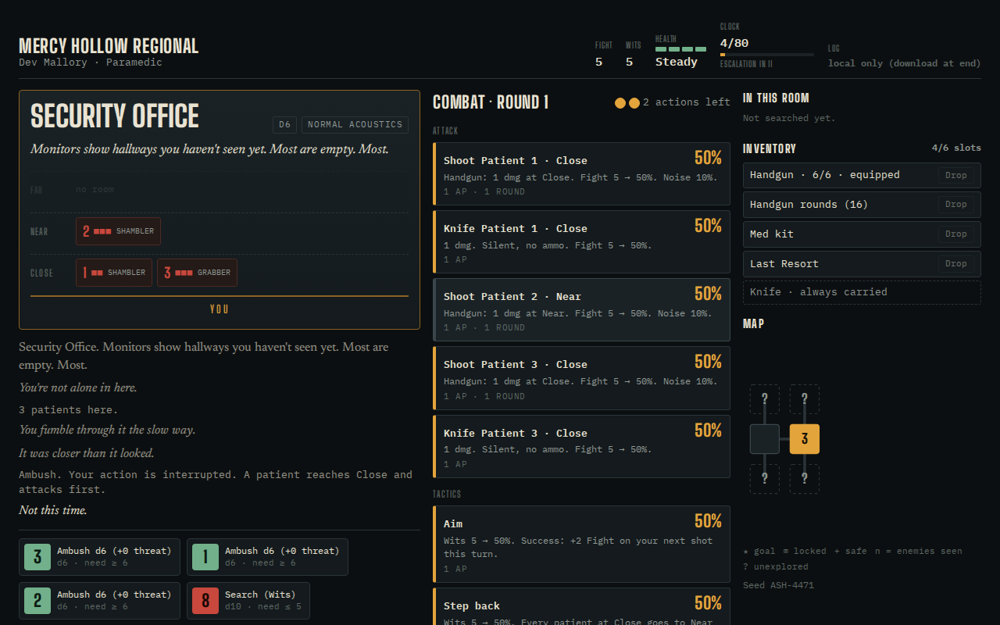

# Night Shift

A turn-based, solo survival-horror crawl with fully visible odds. Every action shows its chance before you commit, every die is rolled on screen, and a failed roll ends your turn. Four scenarios (hospital, mountain hotel, courthouse, research station), three preset survivors each plus a custom build, and seeded maps: the same seed code builds the same map and dice sequence.

Playtest build `v0.4-playtest-1`. Working title.

**Play:** https://justbost.com/night-shift/

## Stack

A single static `index.html` (vanilla HTML/CSS/JS, no build step, no dependencies). Fonts load from Google Fonts. Hosted on GitHub Pages under the org site's `justbost.com` domain.

## Run logs

Each run keeps a full event log (odds shown, dice rolled, state snapshots). On this standalone page the log stays in the browser: use **Download log** on the end screen to save it as JSON. (The private claude.ai build of the game also saves logs to a playtest database; that part is not available here.)

## Local

Open `index.html` in a browser, or serve the folder: `python3 -m http.server`.

## Verification

- 2026-09-25, local, served under `/night-shift/` in headless Chromium at 1280×800: page returned 200, no root-absolute asset paths, seed `ASH-4471` with the Paramedic ran explore → search → ambush → combat (8 dice rendered, clock 4/80), 0 console errors with fonts available.
- 2026-09-25, live (GitHub Pages): the repo's `index.html`, `README.md` and `screenshot.png` match the locally tested files byte for byte (same git blob SHAs). https://justbost.com/night-shift/ serves the page (title "Night Shift", matching meta description), and `/night-shift/screenshot.png` returns image content. The sandbox couldn't open justbost.com in a browser, so the in-browser console check was done on the identical files locally, not on the live URL.
